# 🛒 ShopMicro Production Platform

<p align="left">
  <a href="https://React.js">
    
  </a>
  <a href="https://hub.docker.com/">
    
  </a>
  <a href="https://developer.hashicorp.com/terraform/docs">
    
  </a>
  <a href="Kubernetes">
    
  </a>
  <a href="AWS EKS">
    
  </a>
 </a>
  <a href="AWS ECR">
    
  </a>
 </a>
  <a href="GITHUB ACTIONS">
    
  </a>
</p>

---

- ShopMicro is a cloud-native microservices-based ecommerce platform schowcasing Kubernetes.
The application enables users to browse products through a dynamic React frontend powered by backend APIs and an ML-powered recommendation service.

- The architecture leverages containerized microservices built with **Node.js/Express for the core API and Python/Flask for the machine learning service, supported by PostgreSQL for persistent storage and Redis for caching**. Services are orchestrated within Kubernetes using **namespace isolation, Ingress routing, autoscaling policies, scheduling controls, and persistent storage management**.

- The platform integrates a **full observability stack (metrics, logs, and traces) using Prometheus-compatible monitoring, centralized logging, distributed tracing, and Grafana dashboards** to provide operational visibility and reliability tracking.

---

## 📑 Table of Contents
  
1. 📁 Project Tree  
2. ⚙️ Prerequisites  
3. ☁️ Deployment Setup  
4. 🚀 How to Run Locally  
5. ☁️ How to Deploy to AWS  
6. 🧪 Verification & Testing  
7. 🛠 Backup & Restore  
8. 📌 Rollback Procedure  

---

---

## 📁 Project Tree

```bash
Capstone/
├── .github/
│   └── workflows/
│       ├── ci-cd-deploy.yml
│       ├── ci-cd-drift-detection.yml
│       └── ci-cd-terraform.yml
│
├── backend/
│   ├── Dockerfile
│   ├── package.json
│   ├── package-lock.json
│   └── server.js
│
├── frontend/
│   ├── Dockerfile
│   ├── package.json
│   ├── package-lock.json
│   ├── nginx/
│   ├── public/
│   └── src/
│       ├── assets/
│       │   └── react.svg
│       ├── App.jsx
│       ├── App.css
│       ├── index.css
│       └── main.jsx
│
├── ml-service/
│   ├── Dockerfile
│   ├── app.py
│   └── requirements.txt
│
├── k8s/
│   ├── app-config.yaml
│   ├── backend-deployment.yaml
│   ├── backend-hpa.yaml
│   ├── backend-service.yaml
│   ├── backend-servicemonitor.yaml
│   ├── frontend-deployment.yaml
│   ├── frontend-service.yaml
│   ├── ml-deployment.yaml
│   ├── ml-service.yaml
│   ├── postgres-deployment.yaml
│   ├── postgres-service.yaml
│   ├── postgres-pvc.yaml
│   ├── redis-deployment.yaml
│   ├── redis-service.yaml
│   ├── db-backup-configmap.yaml
│   ├── db-backup-cronjob.yaml
│   ├── db-backup-pvc.yaml
│   ├── networkpolicy.yaml
│   ├── ingress.yaml
│   ├── prometheusalert.yaml
│   ├── iam_policy.json
│   ├── trust-policy.json
│   └── EBS-CustomPolicy.json
│
├── progres/
│   └── init.sql
│
├── runbooks/
│   └── backend-outage.md
│
├── assets/
│
└── docker-compose.yml
```

---

## ⚙️ Prerequisites

- Terraform >= 1.6  
- AWS CLI configured  
- kubectl  
- Helm  
- Docker  
- GitHub repository with secrets configured  

---

## ☁️ Deployment Setup

- **Microservices Architecture:** 
ShopMicro is built using independently containerized services for the Frontend (React), Backend API (Node.js/Express), and ML Recommendation Service (Python/Flask). Each service runs as its own Kubernetes deployment, enabling independent scaling, rolling updates, and fault isolation.  
- **Service Communication:**
Internal service-to-service communication is handled through Kubernetes Services and DNS-based discovery within a dedicated namespace. This allows seamless communication between the backend, ML service, PostgreSQL, and Redis without manual configuration.

- **Ingress & Traffic Routing:**
Traffic enters the cluster through a Kubernetes Ingress controller, which acts as the single external entry point. It routes requests to the appropriate services (frontend or backend API) and enforces controlled exposure of workloads.
    

---

## Component Diagram

<p align="center">
  
</p>

---

**Frontend**
Developed in React.js and served via an NGINX container. The frontend communicates exclusively with the backend API through the Ingress endpoint, ensuring separation between presentation and business logic layers.

**Backend API**
Built using Node.js and Express. Handles product catalog endpoints, service orchestration, database queries, and integration with the ML recommendation service. Instrumented with observability tooling for metrics, logs, and traces.

**ML Recommendation Service**
Implemented using Python/Flask. Provides recommendation responses to the backend service and is independently deployable and scalable within the cluster.

**Databases & Caching**

- PostgreSQL is deployed with persistent storage using Kubernetes PersistentVolumeClaims and a defined StorageClass.

- Redis is used as a caching layer to improve performance and reduce backend load.
- Each stateful component is isolated and secured within the cluster.

---
## ☁ Deployment Setup


### Deployment Diagram

<p align="center">
  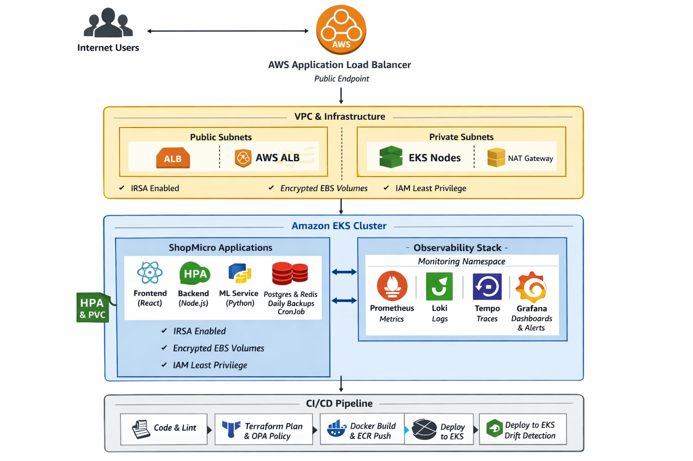
</p>

---


**Containerization**

All services are containerized using Docker with optimized Dockerfiles. Local development and testing are orchestrated via Docker Compose to replicate service interactions before cluster deployment.

**Kubernetes Platform Controls**

The deployment includes:

- Namespace isolation

- Resource requests and limits

- Horizontal Pod Autoscaling (HPA)

- Rolling updates with rollback capability

- Anti-affinity rules for high availability

- NetworkPolicies for least-privilege communication

**Observability Stack**

The platform integrates a full observability layer using:

- Prometheus-compatible metrics

- Centralized logging (Loki)

- Distributed tracing (Tempo)

- Grafana dashboards and alerting

**Infrastructure as Code & Automation**

Infrastructure is defined using modular Terraform architecture (network, compute, data, security layers).
Configuration management is handled via Ansible roles.
CI/CD pipelines automate linting, testing, image builds, infrastructure validation, policy-as-code checks, and deployment workflows.

**AWS Infrastructure**

**Networking (AWS VPC)**
- A dedicated VPC across two Availability Zones (AZs).

- Subnets:
  - 2 Public subnets (1 in each AZ).
  - 2 Private subnets (1 in each AZ).

- Internet Gateway: Attached to VPC for public subnet access for public subnets.

- NAT Gateway: Deployed in one public subnet, allowing outbound internet access for resources in private subnets (e.g., EKS worker nodes pulling Docker images).

- Route Tables:
  - Public route table routes internet-bound traffic via Internet Gateway.
  - Private route table routes internet-bound traffic via NAT Gateway.

**Kubernetes Cluster (AWS EKS)**
- **EKS Cluster** deployed within the above VPC.
- **EKS Node Group (managed worker nodes)** spread across the two AZs for high availability. Worker nodes are deployed in private subnets, ensuring they are not exposed directly to the internet.
- **Application Load Balancer controller** is installed within the EKS cluster, to let traffic route using ingress.
- **Metrics-server** is installed within the EKS cluster, to let Horizontal Pod AutoScaler get the current CPU/memory usage for each Pod.
- **Cluster AutoScaler** is installed within the EKS Cluster, automatically adjusting the number of worker nodes in the EKS cluster based on pending pods.


Horizontal Pod AutoScaler (HPA) is a Kubernetes resource that automatically scales the number of pods in a Deployment, ReplicaSet, or StatefulSet. It continuously watches pod resource metrics (like CPU %, memory %, or custom metrics) from metrics-server. If usage goes above or below a defined threshold, it increases or decreases pods.

Cluster Autoscaler (CA) is a Kubernetes component that automatically adjusts the number of worker nodes in the cluster. If HPA scales up pods but no nodes have enough resources to run them, CA adds new nodes. If nodes are scaled down, it removes nodes to save cost.

**Terraform (Infrastructure as Code)**
- Infrastructure provisioned using Terraform, ensuring reproducibility and automation.
- Terraform manage:
  - VPC (subnets, Internet Gateway, NAT Gateway, route tables).
  - EKS Cluster (Control Plane, Managed Node Groups, Access Entry, Metrics-server, Application Load Balancer Controller, Cluster Autoscaler).
  - ECR Repositories for storing Docker images.

**CI/CD with GitHub Actions**
- Separate workflow files per service for isolation and independent deployments.

- Workflow stages:
  - Build & test
  - Build Docker image and push to ECR
  - Deploy/update Helm release on EKS


## 🚀 How to Run Locally

1. Clone the repository:

```bash
git clone https://github.com/your-repo/capstone.git
cd capstone
```

2. Build Docker images:

```bash
docker build -t shopmicro/frontend ./frontend
docker build -t shopmicro/backend ./backend
docker build -t shopmicro/ml-service ./ml-service
```

3. Deploy locally with minikube or kind.
---

## ☁️ How to Deploy to Amazon EKS

**Prerequistics**

Make sure you have the following tools installed locally:

- kubectl
- Helm
- AWS CLI
- ekctl
- Terraform

**Step 1: Containerization**
- Each component (frontend, service-registry, api-gateway, and microservices) has its own Dockerfile. 
- You don’t need to change anything here. The components will be automatically built and push images to Amazon ECR when running CI/CD.   


**Step 2: Kubernetes Orchestration**

- Each service is deployed as a separate Helm chart under /helm-charts directory. 

**Step 3: AWS Infrastructure**
- AWS resources are provisioned using Terraform manifests in the terraform/ directory. 
- By default, you can’t directly access an eks cluster without the AmazonEKSClusterAdminPolicy.
- Then, run the following commands:

```bash
cd infrastructure/terraform/environments/dev
terraform init
terraform plan
terraform apply
```
- This will create a VPC, subnets (2 public, 2 private), an Internet Gateway, a NAT Gateway, and route tables. You can verify the networking setup from AWS console > VPC > Resource Map.

<p align="center">
  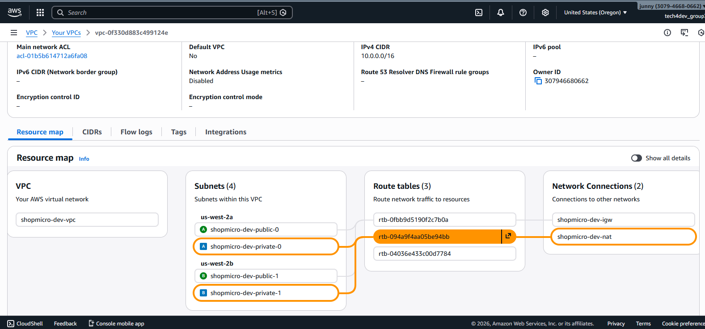
</p>

- This will deploy an EKS cluster (shopmicro-dev), EKS node groups, Application Load Balancer controller, Metrics server, and Cluster autoscaler.

- After Terraform finishes, update your kubeconfig (Ensure the local AWS CLI user has an access entry in the EKS cluster.

```
aws eks update-kubeconfig --region us-west-2 --name shopmicro-dev
```
<p align="center">
  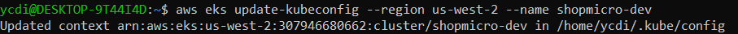
</p>

- Next, ensure that nodes, Application Load Balancer controller, Metrics server, and Cluster autoscaler are installed properly.

<p align="center">
  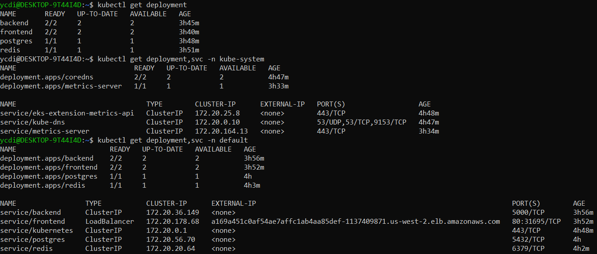
</p>

### Step 4: CI/CD with GitHub Actions

- IAM User for CI/CD
  - Create an IAM user with permissions to EKS and ECR.
  - Ensure this user has an access entry in the EKS cluster.

- Then add the following secrets to your GitHub repository.
- Each service has its own workflow file (ensuring isolation). Trigger workflows from GitHub Actions. Once completed, services will be live in your EKS cluster. 

- Verify cluster resources:
  - Nodes

<p align="center">
  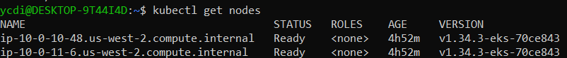
</p>

- Deployments


<p align="center">
  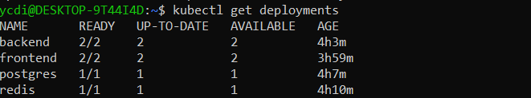
</p>

- Horizontal Pod Autoscaler


<p align="center">
  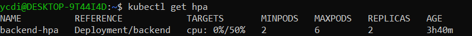
</p>

- Service


<p align="center">
  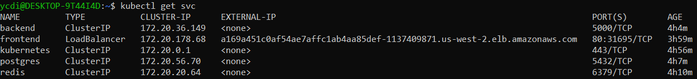
</p>

- Ingress

<p align="center">
  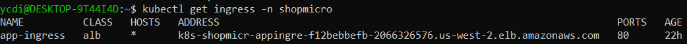
</p>

<p align="center">
  
</p>

- Verify the grafana server via port forwarding

```
kubectl port-forward svc/monitoring-grafana 3000:80 -n monitoring
```

<p align="center">
  
</p>

<p align="center">
  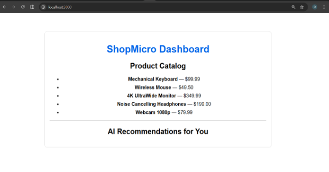
</p>

Copy the Ingress DNS address from the kubectl get ingress and open it in your browser to view the live application.

---


### Step 3: Deploy Kubernetes Resources

```
kubectl apply -f k8s/
```
### Verification & Testing

```
kubectl get pods -n shopmicro
kubectl get ingress -n shopmicro
kubectl get hpa -n shopmicro
kubectl get pvc -n shopmicro
```

- Backend metrics

<p align="center">
  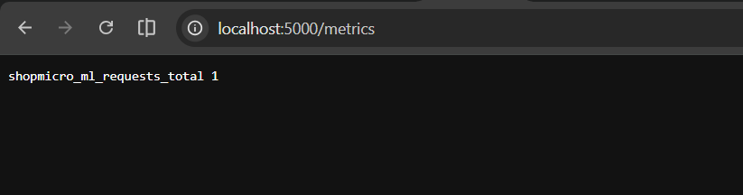
</p>


### Backup & Restore

Automated daily PostgreSQL backups via CronJob.

Manual restore:
 
```
kubectl exec -it <postgres-pod> -n shopmicro -- bash
psql -U postgres shopmicro < backup.sql
```

### Rollback Procedure
```
kubectl rollout history deployment/backend -n shopmicro
kubectl rollout undo deployment/backend -n shopmicro
kubectl rollout status deployment/backend -n shopmicro
```


